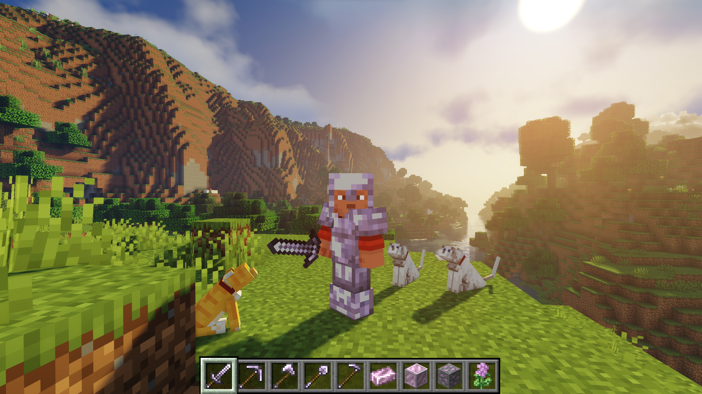
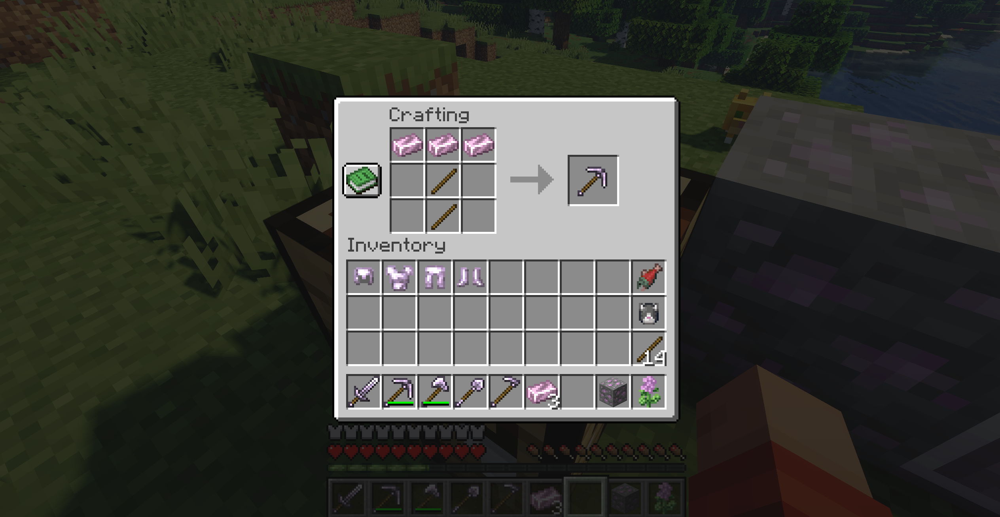
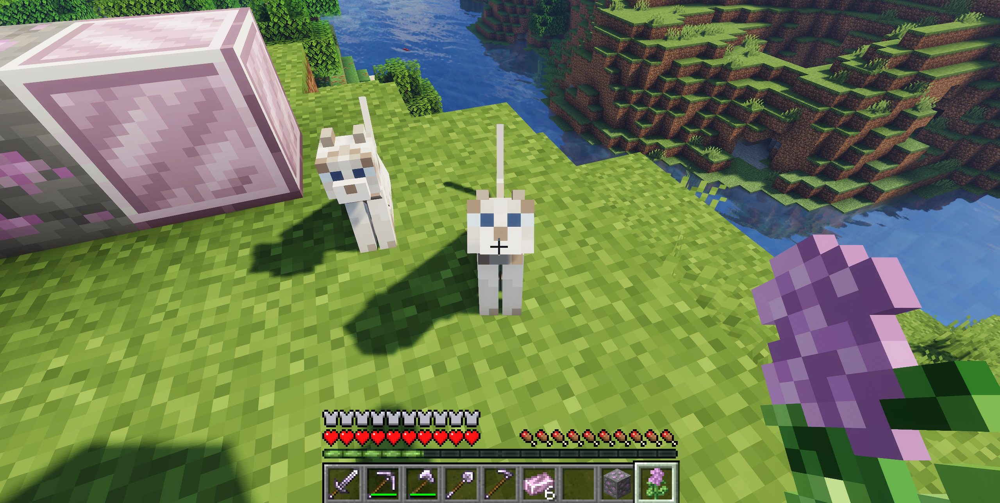
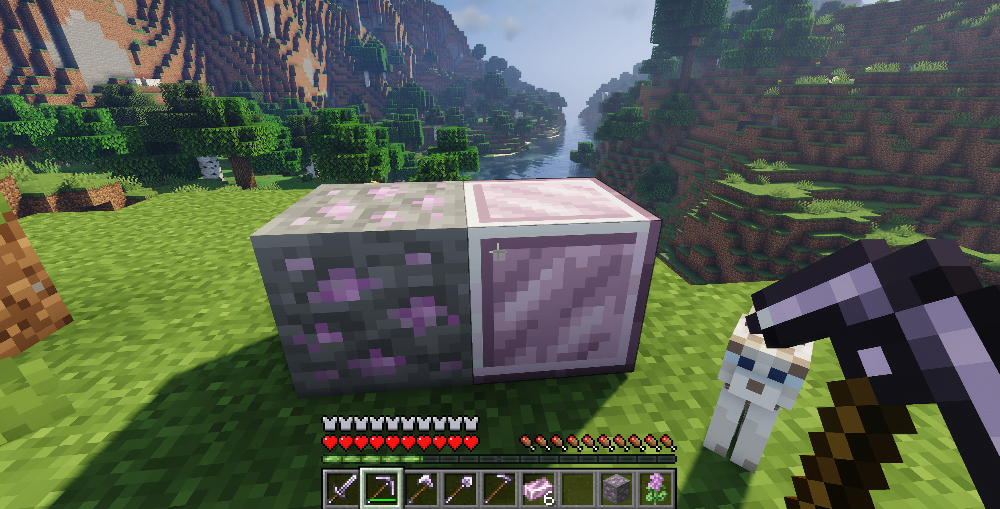

# CatMod — NeoForge Minecraft Mod

A Java-based Minecraft: Java Edition mod built with NeoForge. The project demonstrates mod architecture, registry-driven content creation, data generation, client/server event handling, and custom game assets in a small but complete feature set.



## Overview

CatMod introduces a cat-themed progression material named **Catanium** (`cat` + `-anium`) together with craftable equipment and a small custom entity interaction.

The implementation covers the full path from Java registrations and custom material definitions to generated recipes, models, loot tables, language entries, textures, and sound assets.

## Implemented Features

- **Catanium resource chain** — a Catanium ore block, a storage block, and Catanium slabs.
- **Custom equipment** — Catanium tools and armor backed by dedicated tool-tier and armor-material definitions.
- **Data-generated content** — recipes, models, block states, loot tables, tags, equipment assets, and sound definitions generated through NeoForge data providers.
- **Catnip interaction** — using cat mint on a cat triggers a custom sound effect through mod event handling.
- **Creative-mode integration** — mod content is grouped through a dedicated creative-mode tab.
- **Resource integration** — the project includes localization, textures, sound files, and Mixin configuration.






## Technical Highlights

| Area | Implementation |
|---|---|
| Language | Java |
| Build system | Gradle with the Gradle Wrapper |
| Modding framework | NeoForge |
| Game target | Minecraft: Java Edition |
| Content registration | Centralized block, item, sound, and creative-tab registration classes |
| Equipment | Custom armor material and custom tool tier for Catanium |
| Gameplay behavior | Event-driven interaction logic in `ModEvents` |
| Asset pipeline | NeoForge data generation for recipes, models, loot tables, tags, and sounds |
| Client support | Dedicated client entry point (`CatModClient`) |
| Additional integration | Mixin configuration (`catmod.mixins.json`) |

## Project Structure

```text
src/main/java/com/mateusz/catmod/
├── block/
│   └── ModBlocks.java
├── creativemodtab/
│   └── ModCreativeModeTabs.java
├── datagen/
│   ├── ModBlockLootTableProvider.java
│   ├── ModBlockTagsProvider.java
│   ├── ModEquipmentAssetProvider.java
│   ├── ModItemTagProvider.java
│   ├── ModModelProvider.java
│   ├── ModRecipeProvider.java
│   └── ModSoundsProvider.java
├── event/
│   └── ModEvents.java
├── item/
│   ├── ModArmorMaterials.java
│   ├── ModItems.java
│   └── ModToolTiers.java
├── sound/
│   └── ModSounds.java
├── CatMod.java
├── CatModClient.java
├── CatModDataGen.java
└── Config.java

src/main/resources/
├── assets/catmod/
│   ├── lang/
│   ├── sounds/
│   └── textures/
└── catmod.mixins.json
```

### Architecture Notes

- `CatMod` is the mod entry point and coordinates initialization.
- `ModBlocks`, `ModItems`, and `ModSounds` centralize registry declarations instead of scattering registrations across gameplay classes.
- `ModArmorMaterials` and `ModToolTiers` separate material properties from item registration, making equipment parameters easier to maintain.
- `ModEvents` contains runtime behavior, including the catnip-to-cat interaction.
- The `datagen` package treats generated JSON assets as build output, which reduces manual resource-file maintenance and keeps recipes, models, tags, and loot definitions consistent.


## Running the Mod

For players who want to run the compiled mod:

1. Install Minecraft Java Edition 26.1.2.
2. Install NeoForge 26.1.2.112
3. Download the `.jar` file from the
   [latest GitHub Release](../../releases/latest).
4. Place the downloaded file in the Minecraft `mods` directory.
5. Launch the game with the NeoForge profile.


> The `.jar` must not be extracted.


## Local Development

### Prerequisites

- A JDK version compatible with the Minecraft/NeoForge version configured in this repository
- Git
- An IDE with Java and Gradle support, such as IntelliJ IDEA

### Clone and build

```bash
git clone https://github.com/MateuszLucinski/catmod_minecraft_26.X.git
cd catmod_minecraft_26.X
./gradlew build
```

On Windows:

```bat
gradlew.bat build
```

The built mod JAR is generated in:

```text
build/libs/
```

### Run a development client

```bash
./gradlew runClient
```

### Generate data assets

```bash
./gradlew runData
```

The data-generation task is intended to produce and update content such as recipes, models, block states, tags, loot tables, equipment assets, and sound definitions.

## Screenshots





## Project Scope

CatMod is a focused engineering project that uses a compact gameplay concept to demonstrate the main layers of a NeoForge mod:

1. Defining and registering content.
2. Assigning custom material behavior to equipment.
3. Responding to game events.
4. Integrating assets and localization.
5. Automating JSON-content generation through Gradle data-generation tasks.
6. Packaging the result as a distributable Minecraft mod JAR.

## License

This project is licensed under the [MIT License](LICENSE.txt).
---

Developed by [Mateusz Luciński](https://github.com/MateuszLucinski) as a Java / NeoForge portfolio project.